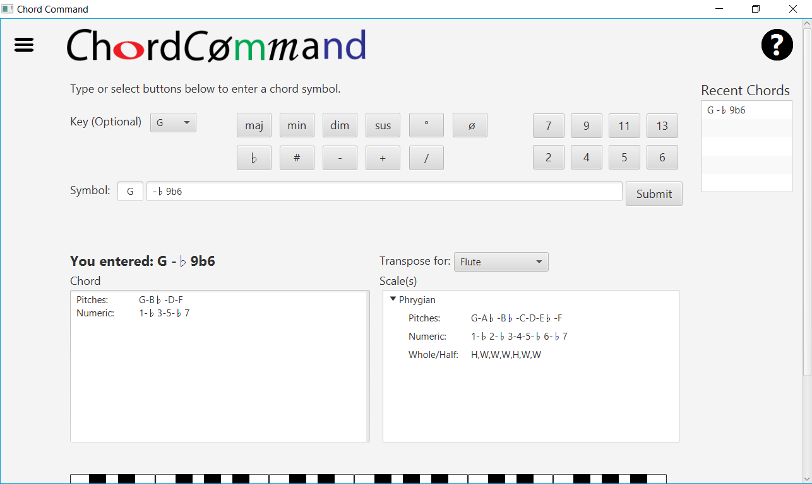

"Khordḗ": meaning "string of gut" in Ancient Greek. From these unromantic origins comes the most evocative ingredient in music—the chord, a series of three or more notes played at once. From the haunting air of a minor key to the soulful sound of a blues chorus, the chord sets music's mood.

Unfortunately, the reality of the chord's representation in written music is closer to the origins of the word than to its current incarnation. Chords are noted using letters, symbols, numbers, and abbreviations. A single chord, like C Major 7, often has multiple representations, like Cmaj7, CM7, and C∆7, which leaves a musician scrambling for a theory book or caroming from one search result to the next.

Enter **ChordCommand**. **ChordCommand** is the work of a software-development student, who is also an avid musician. This software puts dozens of chords and scales at a musician's fingertips. The user enters a chord, and **ChordCommand** outputs various representations. For example, a Cmin7 entry yields 1-b3-5-b7; C-Eb-G-Bb; and a piano graphic as representations of chord structure and 1-2-b3-4-5-b6-b7-8; C-D-Eb-F-G-Ab-Bb-C; and WHWWHWW as scale representations, with output options configurable by the user.

Even if you're not a performer, student, teacher or composer, you'll be surprised what you can learn by using **ChordCommand** to explore chords from a favorite song or genre.

## Getting Started
* [Installation](#installation)
* [Using ChordCommand](#using-chordcommand)
* [Documentation](#documentation)
* [Development Environment](#development-environment)

## Installation

Currently **ChordCommand** is only officially supported for use on Windows platforms. The specifics of installing it on a different platform will be different than the ones below.

To install and use **ChordCommand**, you need the following components:
* Java SE Runtime Environment, aka JRE
* ChordCommand Installer
* MySQL Server

### Java SE Runtime Environment
Chances are good that you already have this on your computer. If you're not sure, visit the link, download the .exe, and start the installer. If you already have Java installed, the installer will tell you that.

To install the JRE, simply go to http://www.oracle.com/technetwork/java/javase/downloads/jre8-downloads-2133155.html

Click "Accept License Agreement" and then click to select a download for your computer. When the download finishes, open it and follow the directions on the screen to complete the installation.

### ChordCommand Installer
1.	Navigate to https://github.com/charlotte-hirschberg/ChordCommand/releases You’ll see “Downloads” under the “Latest Release” heading. The “Latest Release” heading will be in large blue font.
3.	You are only interested in two files: **ChordCommand-1.0.exe** and **ChordDbDump.sql**. Click each of these files in turn to start the download.
4. Note the location of the ChordDbDump.sql file. You'll need to know this later. Open ChordCommand.exe to start the installer. Upon completion, the installer will try to open **ChordCommand**. You’ll see an error message at that time because the database is not ready. Just close the error dialog, and proceed to the next step.

### MySQL Server
There are 4 major parts to this step:
* Install the server
* Configure the server
* Prepare the database
* Create the user

All of these parts are described in greater detail in **ChordCommand's** [Documentation](#documentation).

#### Install the server
Navigate to https://dev.mysql.com/downloads/installer/ and scroll down to see and select a download. You'll be downloading MySQL Installer, which will help you install the server and Workbench, a user-friendly tool that will help you with the next steps.

After you open the download and follow the on-screen instructions to complete installation, open MySQL Workbench from the MySQL folder in your Start menu.

#### Configure the server
1. From the Workbench home screen, click the "+" next to "MySQL Connections."
2. Choose a Connection Name and replace any numbers in Hostname with "localhost". Verify that the Port is 3306.
3. Enter a Username and Password. To set a password, click "Store in Vault", type your password, and then click "OK".
4. Click "OK" one more time to finalize your changes. You should see the new connection on the home screen.
If you’re having trouble creating a connection, see MySQL’s documentation at: https://dev.mysql.com/doc/workbench/en/wb-getting-started-tutorial-create-connection.html

#### Prepare the database
1. Open Workbench if necessary. From the home screen, double click the connection you created earlier.
2. From the screen that appears, select the “Server” menu and then “Data Import.”
3. When the Data Import dialog appears, select the circle next to “Import from Self-Contained File”. Click the button with three dots to navigate to the directory you noted after downloading ChordDbDump.sql. Select ChordDbDump.sql as the file to import. When you’re finished selecting the file, click the “Import Progress” tab.
4.	From the “Import Progress” tab, click “Start Import” to finish installing the database files.

#### Create the user
1. Open the “Server” menu again. Select “Users and Privileges”.
2. Click “Add Account” at the bottom of the screen.
3.	In the Login tab, enter the following details:
  * Login Name: 			          ccClient
  * Password/Confirm Password: 	cH0rd$1357
4.	Leave the other settings unaltered, and select “Apply” in the bottom right corner. Close Workbench. 

Congratulations, you should be able to use ChordCommand now by accessing it from the Start menu!

## Using ChordCommand
Using **ChordCommand** is pretty simple, and the first time you open it you'll see a Help screen that makes it even simpler. Once you close the Help screen, you can always access it again via the question mark in the top-right corner of the main screen.

The main screen also has a menu in its top-left corner. Use the menu to access Preferences, where you're able to change what appears on the screen after you enter a chord.

Inserting a chord involves selecting a key from the Key dropdown and then entering the remainder of the symbol. Entering the remainder of the symbol can be accomplished by typing, pasting, using the on-screen buttons, or combining these methods. Here's the output for the chord symbol "G-♭9♭6". 'G' was selected from the dropdown box. The numbers, the minus sign, and 'b' were entered via the keyboard, and the flat symbol ♭ was entered using an on-screen button. 

Notice that 'b' and ♭ are treated identically. **ChordCommand** was designed to be very flexible. As another example, a minor chord can be entered with '-', "mi", "min", "MI", or "MIN".

## Documentation
We highly recommend that you have a look at **ChordCommand's** documentation if you're having trouble with these instructions or if you're considering contributing to development. The documentation is a Word document titled ChordCommand Documentation.docx, located in this repository.

## Development Environment
If you want to contribute to **ChordCommand**, we recommend the following 6 components:
* Java SE Development Kit (JDK)
* IDE with Java support, like NetBeans
* GitHub Account
* GitHub Shell or Plugin
* ChordCommand Source Code
* MySQL Server

### Java SE Development Kit (JDK)
Navigate to Oracle’s JDK downloads page: http://www.oracle.com/technetwork/java/javase/downloads/jdk8-downloads-2133151.html Click "Accept License Agreement" and select a download. When the download completes, open it and follow the directions in the installation wizard.

### NetBeans
Other IDEs, like Eclipse, support Java, but the instructions here describe the process with NetBeans.
1.	Navigate to the NetBeans downloads page at https://netbeans.org/downloads/
2.	Select your Language and Platform from the dropdown menus at the top right and then click the Download button for Java SE. When the download completes, open it and follow the directions in the installation wizard.

### GitHub Account
1.	If you don’t have a GitHub account, register for one at https://github.com/join
2.	Navigate to the ChordCommand repository at https://github.com/charlotte-hirschberg/ChordCommand. To push code to the repository for approval and incorporation by the ChordCommand team, you need to be an official Collaborator. Email charlotte.hirschberg@mymail.champlain.edu to be added as a Collaborator.

### GitHub Plugin
Everything you can accomplish (and more) with NetBean’s GitHub Plugin can be accomplished via the Git Shell. However, if you are new to Git or the command line, the Plugin offers a much more user-friendly experience.
1.	Open NetBeans and select “Plugins” from the Tools menu.
2.	Switch to the “Available Plugins” tab, click the check box next to “Git”, and select Install. Follow the instructions on the screen to complete the installation.

### ChordCommand Source Chord
Open NetBeans. Clone the **ChordCommand** repository by following these directions https://netbeans.org/kb/docs/ide/git.html#clone and using https://github.com/charlotte-hirschberg/ChordCommand as the "Repository URL".

### MySQL Server
Follow the directions in [Installation](#installation) to install, configure, and prepare MySQL. One important difference: when preparing the database, specify the location of ChordDbDump.sql in the local directory you created while cloning the **ChordCommand** repository.

### Working on Code
If you are unfamiliar with Git, it is strongly recommended that you read Atlassian’s Git tutorial to understand the underlying concepts:
* https://www.atlassian.com/git/tutorials/what-is-version-control

To work on the code you cloned, please observe the following directions:
1. Create a new branch (directions below). This will isolate your untested code from existing code, so any bugs won't 'break' the existing work.
2. Commit your changes. Follow these directions: https://netbeans.org/kb/docs/ide/git.html#committing
3. Push your changes. Follow these directions: https://netbeans.org/kb/docs/ide/git.html#push
4. Submit a Compare & pull request. You do this by navigating to the **ChordCommand** repository in your Web browser. Once there, open the "Branch" dropdown, and you should see your branch listed. Click your branch. On the next page, click "Compare & pull request" and enter a message on the page that follows. 

After you submit your pull request, GitHub might tell you that merging can be completed automatically, but please do not merge the pull request yourself. Let others test and review your code, and a member of **ChordCommand’s** core development team will approve and perform the merge. **Thank you!**
